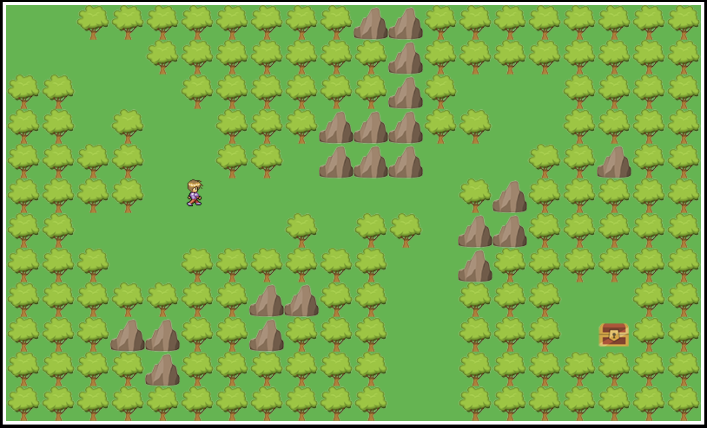

# :european_castle: Dungeon Crawler Game :european_castle:

This is Guillaume's Dungeon Crawler Game.

## Technologies used:

- JavaScript
- ES6 syntax
- create-react-app
- React
- Redux
- CSS
- Flexbox
- Standard

## Game preview:



## How to run it:

clone repo and

```
cd dungeon-crawler-game
yarn install
yarn start
```

## Deployed via Github Pages:

[Guillaume's Dungeon Crawler Game](https://gbouffard.github.io/dungeon-crawler-game/)
